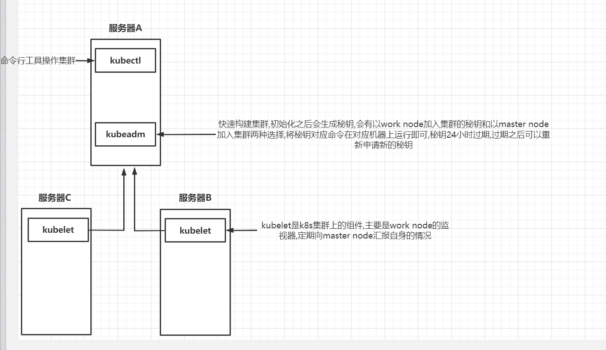

# 搭建k8s集群

---

## 1.搭建环境

### 1.1 搭建docker环境

- 移除之前docker包

  ``` bash
  sudo yum remove docker \
                    docker-client \
                    docker-client-latest \
                    docker-common \
                    docker-latest \
                    docker-latest-logrotate \
                    docker-logrotate \
                    docker-engine
  ```

  

- 配置yum源

  ```bash
  sudo yum install -y yum-utils
  sudo yum-config-manager \
  --add-repo \
  http://mirrors.aliyun.com/docker-ce/linux/centos/docker-ce.repo
  ```

  

- 安装docker

  ```bash
  sudo yum install -y docker-ce docker-ce-cli containerd.io
  ```

  

- 配置阿里云镜像加速

  ```bash
  sudo mkdir -p /etc/docker
  sudo tee /etc/docker/daemon.json <<-'EOF'
  {
    "registry-mirrors": ["https://utyi920s.mirror.aliyuncs.com"]
  }
  EOF
  sudo systemctl daemon-reload
  sudo systemctl restart docker
  ```

  

- 启动docker

  ```bash
  systemctl enable docker --now
  ```

  

参考文档

1. [https://docs.docker.com/engine/install/centos/](https://docs.docker.com/engine/install/centos/)

### 1.2 搭建k8s环境

- 基础设置

  ```bash
  #各个机器设置自己的域名
  hostnamectl set-hostname xxxx
  
  
  # 将 SELinux 设置为 permissive 模式（相当于将其禁用）
  sudo setenforce 0
  sudo sed -i 's/^SELINUX=enforcing$/SELINUX=permissive/' /etc/selinux/config
  
  #关闭swap
  swapoff -a  
  sed -ri 's/.*swap.*/#&/' /etc/fstab
  
  #允许 iptables 检查桥接流量
  cat <<EOF | sudo tee /etc/modules-load.d/k8s.conf
  br_netfilter
  EOF
  
  cat <<EOF | sudo tee /etc/sysctl.d/k8s.conf
  net.bridge.bridge-nf-call-ip6tables = 1
  net.bridge.bridge-nf-call-iptables = 1
  EOF
  sudo sysctl --system
  
  ```

  

- 安装`kubelet`、`kubeadm`、`kubectl`

  ```bash
  cat <<EOF | sudo tee /etc/yum.repos.d/kubernetes.repo
  [kubernetes]
  name=Kubernetes
  baseurl=http://mirrors.aliyun.com/kubernetes/yum/repos/kubernetes-el7-x86_64
  enabled=1
  gpgcheck=0
  repo_gpgcheck=0
  gpgkey=http://mirrors.aliyun.com/kubernetes/yum/doc/yum-key.gpg
     http://mirrors.aliyun.com/kubernetes/yum/doc/rpm-package-key.gpg
  exclude=kubelet kubeadm kubectl
  EOF
  
  
  sudo yum install -y kubelet-1.20.9 kubeadm-1.20.9 kubectl-1.20.9 --disableexcludes=kubernetes
  
  sudo systemctl enable --now kubelet
  
  ## kubelet是k8s的组件,kubectl是k8s命令行工具,kubeadm是快速构建k8s集群的工具
  ```

  

- 下载各节点所需镜像

  ```bash
  sudo tee ./images.sh <<-'EOF'
  #!/bin/bash
  images=(
  kube-apiserver:v1.20.9
  kube-proxy:v1.20.9
  kube-controller-manager:v1.20.9
  kube-scheduler:v1.20.9
  coredns:1.7.0
  etcd:3.4.13-0
  pause:3.2
  )
  for imageName in ${images[@]} ; do
  docker pull registry.cn-hangzhou.aliyuncs.com/lfy_k8s_images/$imageName
  done
  EOF
     
  chmod +x ./images.sh && ./images.sh
  ```

  

- 初始化主节点

  ```bash
  #所有机器添加master域名映射，以下需要修改为自己的
  echo "主节点私有ip  cluster-endpoint" >> /etc/hosts
  
  
  #主节点初始化
  kubeadm init \
  --apiserver-advertise-address=172.31.0.4 \
  --control-plane-endpoint=cluster-endpoint \
  --image-repository registry.cn-hangzhou.aliyuncs.com/lfy_k8s_images \
  --kubernetes-version v1.20.9 \
  --service-cidr=10.96.0.0/16 \
  --pod-network-cidr=192.168.0.0/16
  
  #所有网络范围不可以重叠
  
  
  ```

  

- 部署主节点成功信息

  ```bash
  Your Kubernetes control-plane has initialized successfully!
  
  To start using your cluster, you need to run the following as a regular user:
  
    mkdir -p $HOME/.kube
    sudo cp -i /etc/kubernetes/admin.conf $HOME/.kube/config
    sudo chown $(id -u):$(id -g) $HOME/.kube/config
  
  Alternatively, if you are the root user, you can run:
  
    export KUBECONFIG=/etc/kubernetes/admin.conf
  
  You should now deploy a pod network to the cluster.
  Run "kubectl apply -f [podnetwork].yaml" with one of the options listed at:
    https://kubernetes.io/docs/concepts/cluster-administration/addons/
  
  You can now join any number of control-plane nodes by copying certificate authorities
  and service account keys on each node and then running the following as root:
  
    kubeadm join cluster-endpoint:6443 --token slnhrm.ygp5t4fdg358c8av \
      --discovery-token-ca-cert-hash sha256:2a17f7055d3221d5bdb5d4e3fbe9024487b5ad36836a7d655aa25042f20dce62 \
      --control-plane 
  
  Then you can join any number of worker nodes by running the following on each as root:
  
  kubeadm join cluster-endpoint:6443 --token slnhrm.ygp5t4fdg358c8av \
      --discovery-token-ca-cert-hash sha256:2a17f7055d3221d5bdb5d4e3fbe9024487b5ad36836a7d655aa25042f20dce62
  ```

  

  >部署成功的信息中有新节点加入集群的方式
  >
  >两种方式
  >
  >1. 加入`master node`
  >2. 加入`work node`
  >
  >按照提示信息在想要加入的机器上执行相应的命令即可

- 获取新令牌

  >提示成功信息中的令牌是有过期时间的
  >
  >```bash
  ># 获取新令牌
  >kubeadm token create --print-join-command
  >```
  >
  >


## 2.部署过程解析

1. 部署docker环境
2. 部署k8s环境
3. 使用`kubeadm`初始化主节点
4. 用初始化主节点的成功信息,部署`work node`也可以部署`master node`


