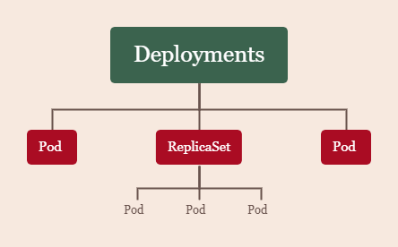

# Kubernetes基本概念详解

----

## 1.Kubernetes组件

## 2.Kubernetes中各组件

### 2.1 Control Plane Components(控制平面组件)

一般在kubernetes集群中部署在master节点上,起到控制管理全局的作用

#### kube-apiserver

> **Kubernetes的请求入口** ,主要负责处理请求的工作,根据具体的请求,去通知其他组件

#### etcd 

>**Kubernetes的存储服务**,etcd是一个键值对数据存储,存储了Kubernetes的关键配置和用户配置,只可以通过`kube-apiserver`来进行读写

#### kube-scheduler

>**负责调度所有Kubernetes中的work node**,在部署服务时,会根据负载等指标来选择`work node`

#### kube-controller-manager

>**监控所有work node上部署服务的状态**,监控着所有`work node`的状态,根据当前状态调用相应的`controller`(**controller-manager中有多个controller,每个controller负责不一样的功能**)去调整服务状态

### 2.2 Node 组件 

#### kubelet

>**work node的监视器,以及与master node进行通讯**,会定期向`master node`汇报自身node的情况(`work node`)
>
>**master node与Control Plane的关系:经查阅资料,现初步认为Control Plane是部署在master node上用以控制全局的,是Kubernetes的大脑,不认为二者等价,还待进一步实验来证明**

#### kube-proxy 

>**Kubernetes的网络代理**,负责Kubernetes的网络通讯以及流量的负载均衡

#### Container Runtime

>**work node的运行环境**,即容器化运行时所需的软件环境,确保容器能跑起来

## 3.Kubernetes中涉及到的对象

### Pod

>**Pod 是可以在 Kubernetes 中创建和管理的、最小的可部署的计算单元**
>
>Pod对Kubernetes,就如同进程对计算机的意义,同一个Pod中的容器化服务可以通过`localhost`互相访问,就好像部署在了同一台计算机上,不同Pod之间不可以直接通过`localhost`进行访问
>
>**Kubernetes中所有对象都是用yaml的形式来表示**
>
>深入描述请见Pod详解一文内容

### Deployments和ReplicaSet

>Deployments是管理Pod和ReplicaSet的,ReplicaSet是管理Pod的
>
>
>
>Deployments是可以直接管理Pod,也可以管理ReplicaSet,使用Kubernetes时,直接使用Deployments即可,Kubernetes会自动生成符合要求的Pod和ReplicaSet

### Service和Ingress

>管理Pod的网络服务
>
>**Service**
>
>将运行在一组Pod上的应用程序公开为网络服务的抽象方法,Service是用来管理Pod与Pod之间的网络服务,屏蔽了细节,主要负责Kubernetes集群内部的网络拓扑,Service本质也是对象
>
>**Ingress**
>
>Ingress 是对集群中服务的外部访问进行管理的 **API 对象**,典型的访问方式是 HTTP集群外部访问内部主要就靠Ingress来解决了,外部请求进来顺序**Ingress->Service->Pod**

### Volume

>Pod内部的磁盘资源,有很多种不同的数据卷类型来处理不同的需求

### ConfigMap和Secret

>**用来存储配置的API对象**, Pod可以将其用作环境变量、命令行参数或者存储卷中的配置文件,ConfigMap提供不加密的存储配置服务,Secret提供加密的存储配置服务

### namespace

>与上面所有与Pod有关的对象不同的是,namespace是针对整个Kubernetes集群来讲的对象,是用来隔离资源的对象,可以将Kubernetes集群划分为若干个资源不共享的虚拟集群

参考资料链接:

1. https://kubernetes.io/docs/concepts/
2. https://zhuanlan.zhihu.com/p/292081941