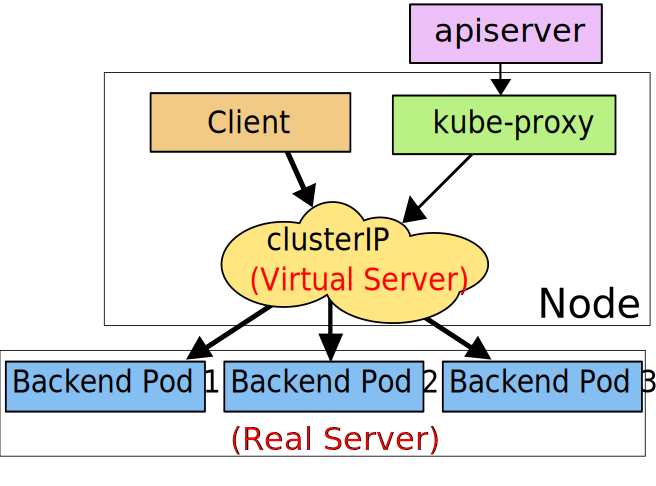

# Kubernetes 网络模型

----

## 1.基本概念

官方定义

> 集群中每一个 Pod 都会获得自己的、 独一无二的 IP 地址，,这就意味着你不需要显式地在  Pod 之间创建链接,你几乎不需要处理容器端口到主机端口之间的映射. 这将形成一个干净的、向后兼容的模型；在这个模型里,从端口分配、命名、服务发现、 负载均衡、 应用配置和迁移的角度来看,Pod 可以被视作虚拟机或者物理主机
>
> 补充说明  [https://kubernetes.io/zh-cn/docs/concepts/services-networking/](https://kubernetes.io/zh-cn/docs/concepts/services-networking/)

## 2. Service

### 2.1. Pod基本概念

Service 的作用就是在 Pod 与 Pod 之间管控网络服务,具体作用

- 将真实服务抽象在一起,提供了一个统一可以访问的接口,比如将服务A部署了3个 Pod ,只需要关注一个抽象出来的 Service 入口即可,不需要关注服务实现的细节
- 还可以做 Pod 之间 流量的负载均衡
- 抽成一个接口的好处还有,外部用户不用关心 Pod 崩溃后,重新拉起 Pod 带来的IP地址迁移

Service实际就是将 Pod 分为一组,然后对外提供一个统一的IP地址进行访问,决定将哪些 Pod 分成一组一般是由选择算符来决定的


定义 Service

```yaml
apiVersion: v1
kind: Service
metadata:
  name: my-service
spec:
  selector:
    app: MyApp
  ports:
    - protocol: TCP
      port: 80
      targetPort: 9376
```

Service 默认的网络协议是 TCP ,其他支持的协议

 [https://kubernetes.io/zh-cn/docs/concepts/services-networking/service/#protocol-support](https://kubernetes.io/zh-cn/docs/concepts/services-networking/service/#protocol-support)

也可以不使用选择算符进行抽象,不使用选择算符的 Service 可以抽象其他类型的 Pod ,也包括集群外的服务


### 2.2.虚拟 IP 和 Service 代理

在 Kubernetes 集群中,每个 Node 都有一个 `kube-proxy` 进程, `kube-proxy`负责为 Service 实现虚拟IP

代理模式

1. `userspace` 代理模式

   >这种模式,`kube-proxy` 会监视 Kubernetes 控制平面对 Service 对象和 Endpoints 对象的添加和移除操作. 对每个 Service,它会在本地 Node 上随机打开一个端口. `kube-proxy` 配置 iptables 规则,捕获到达该 Service 的 clusterIP 和 `Port` 的请求,并重定向到代理端口,代理端口再代理请求到 Pod
   >
   >默认情况下,该模式下的 `kube-proxy` 通过轮转算法选择 Pod

   

2. `iptables` 代理模式

   >这种模式, `kube-proxy` 会监视 Kubernetes 控制节点对 Service 对象和 Endpoints 对象的添加和移除.对每个 Service,它会配置 iptables 规则,从而捕获到达该 Service 的 `clusterIP` 和端口的请求,进而将请求重定向到 Service 的一组后端中的某个 Pod 上面.
   >
   >默认的策略是，`kube-proxy` 在 iptables 模式下随机选择一个

   

3. `ipvs` 代理模式

   >在 `ipvs` 模式下,`kube-proxy` 监视 Kubernetes 服务和端点,调用 `netlink` 接口相应地创建 IPVS 规则,并定期将 IPVS 规则与 Kubernetes 服务和端点同步.该控制循环可确保 IPVS 状态与所需状态匹配.访问服务时,IPVS 将流量定向到后端Pod之一,`ipvs` 模式就是在请求与 Pod 之间加了一层代理
   >
   >IPVS 提供了更多选项来平衡后端 Pod 的流量
   >
   >- `rr` : 轮替(Round-Robin)
   >- `lc`: 最少链接(Least Connection),即打开链接数量最少者优先
   >- `dh`: 目标地址哈希(Destination Hashing)
   >- `sh`: 源地址哈希(Source Hashing)
   >- `sed`: 最短预期延迟(Shortest Expected Delay)
   >- `nq`: 从不排队(Never Queue)

   

## 3. Ingress

与 Service 职责不同,Ingress 是对集群中服务的外部访问进行管理的 API 对象,典型的访问方式是 HTTP

Ingress 不会公开任意端口或协议.将 HTTP 和 HTTPS 以外的服务公开到 Internet 时,通常使用 [Service.Type=NodePort](https://kubernetes.io/zh-cn/docs/concepts/services-networking/service/#type-nodeport) 或 [Service.Type=LoadBalancer](https://kubernetes.io/zh-cn/docs/concepts/services-networking/service/#loadbalancer) 类型的 Service

Ingress 必须与 Ingress 控制器配合使用,仅创建 Ingress 没有任何效果


网络模型部分概念过多,再详细了解全部相关概念后,补齐本章笔记