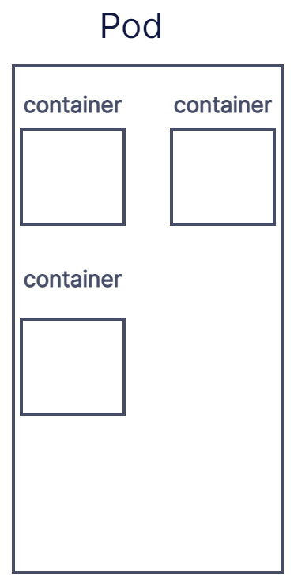

# Pod详解

----

## 1.Pod基础

### 1.1.什么是 Pod

Pod中包含一个或多个 Container,是 Kubernetes 中创建和管理的最小的可部署的计算单元



Pod 和 Container 的关系是一种包含关系, Pod 有数量不等的 Container

在 Kubernetes 中使用 Pod 采取的是`yaml`格式

```yaml
apiVersion: v1

kind: Pod

metadata:

  name: nginx

spec:

  containers:

  - name: nginx

    image: nginx:1.14.2

    ports:

    - containerPort: 80

```

这是表示一个 Pod 中有一个 nginx 镜像,运行这个`yaml`需要使用下面命令

```bash
kubectl apply -f https://k8s.io/examples/pods/simple-pod.yaml
```

### 1.2.管理 Pod

在实际使用中很少会直接创建单个 Pod, 一般都会选择创建Deployment来间接的创建 Pod ,因为Deployment能够处理副本的管理、上线,并在 Pod 失效时提供自愈能力

一般 Deployment 等工作负载会通过Pod模板来创建并管理 Pod ,Pod 模板是包含在工作负载对象中的规范,当某工作负载的 Pod 模板被改变时,制器会基于更新的模板创建新的 Pod 对象而不是对现有 Pod 执行更新或者修补操作


在 Kubernetes 中并不禁止直接管理 Pod ,但对有些操作是有限制的

- Pod 的绝大多数元数据都是不可变的.例如,你不可以改变其 `namespace`、`name`、 `uid` 或者 `creationTimestamp` 字段；`generation` 字段是比较特别的,如果更新 该字段,只能增加字段取值而不能减少
- 如果 `metadata.deletionTimestamp` 已经被设置,则不可以向 `metadata.finalizers` 列表中添加新的条目
- Pod 更新不可以改变除 `spec.containers[*].image`、`spec.initContainers[*].image`、 `spec.activeDeadlineSeconds` 或 `spec.tolerations` 之外的字段. 对于 `spec.tolerations`,你只被允许添加新的条目到其中
- 在更新`spec.activeDeadlineSeconds` 字段时,以下两种更新操作是被允许的:
  1. 如果该字段尚未设置,可以将其设置为一个正数；
  2. 如果该字段已经设置为一个正数,可以将其设置为一个更小的、非负的整数

### 1.3. Pod 联网

Pod 之中的 Container 是可以进行数据共享和通信的,每个 Pod 都可以获得一个唯一的 IP .Pod 中的每个容器共享网络名字空间,包括 IP 地址和网络端口,同一 Pod 下的 Container 可以使用 `localhost` 进行通信,也可以通过进程通信的方式进行通信,不同 Pod 之间就需要通过 IP 来进行访问了


## 2. Pod 的生命周期

### 2.1. Pod 的生命周期中的阶段

- Pending :起始阶段
- Running :有至少一个容器运行成功进入此阶段
- Succeeded 或者 Failed : 取决于 Pod 中是否有容器以失败状态结束,都成功终止了就是 Succeeded 状态
- Unknown : 无法获得 Pod 状态时的状态,通常都是 Pod 与主机通信失败导致的

在 Pod 内部,Kubernetes 跟踪不同容器的状态并确定使 Pod 重新变得健康所需要采取的动作,比如可以实现根据 Pod 所处的阶段进行对应操作实现 Pod 自愈

### 2.2. Pod 中容器的状态

- Waiting : 处在 Waiting 状态的容器完成启动需要的操作,如:拉取镜像、向容器中应用配置数据等方法,可以通过`kubectl` 来查询包含 容器的 Pod ,会有一个 Reason 字段,给出处在 Waiting 状态的原因
- Running : 表明容器正在执行状态,可以使用 `kubectl` 进行查询,会给出进入此状态的详细信息 
- Terminated : 表明容器正在结束状态,可能是正常终止也可能是因为失败终止,同样可以使用 `kubectl` 进行查询,同样会返回详细信息


### 2.3.容器探针

probe 是由 `kubectl`对容器进行定期检查的一种机制

使用探针进行检查必须符合四种机制中的一种

- `exec` : 在容器内执行命令,如果返回码为0,即为检查成功
- `grpc` : 使用`grpc`执行远程调用,如果响应状态是"SERVING",则认为检查成功
- `httpGet` : 对容器指定端口执行Get请求,根据http状态码判断是否成功
- `tcpSocket` : 对容器指定端口进行tcp检查,如果端口打开,则认为检查成功

针对运行中的容器可以选择执行以下三种探针

- **livenessProbe** : 探测容器是否存活,如果探测是否存活失败会杀死容器
- **readinessProbe** : 探测容器是否准备好为请求提供服务,如果探测失败, 端点控制器将从与 Pod 匹配的所有服务的端点列表中删除该 Pod 的 IP 地址
- **startupProbe** : 探测容器中应用是否已启动,如果提供该探针,则所有其他探针都会被禁用,探测失败会杀死容器

